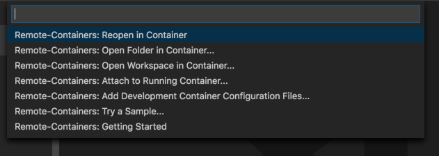

## Opening the project in Visual Studio Code

Open Visual Studio Code (VSC), click _File -> Open Folder_, navigate to the folder containing the thanatos project, Click **Open**.

The project will load in VSC.

Once loaded, click on the small green Icon on the bottom left hand corner of the editor. 

This will make the remote select dropdown appear.



Chose **Remote-Containers: Reopen in Container**.

The project will now open in a docker container.


The first time opening the container will take a while, as the required images need to be downloaded from the [Docker Image Hub](https://hub.docker.com/), to build the container.

The container will be fully loaded and ready to use when the icon in the bottom left switches from **↻ Opening Remote...** to **Dev Container: THANATOS**.

### Setting up the API and UI

On first run of, or after you rebuild, your container it is necessary to setup the UI and API. Thi can be done by opening a _Terminal Window_ in VSCode and running `setupApp` at the prompt.

```nohighlight
╭──vscode@thanatos-app /app  ‹develop›
╰─➤  setupApp
Setting up the API database and loading seed data, if present.
Operations to perform:
  Apply all migrations: admin, auth, contenttypes, core, sessions
Running migrations:
  No migrations to apply.
Installed 33 object(s) from 1 fixture(s)
Setting up the UI package list.
npm WARN @babel/plugin-bugfix-v8-spread-parameters-in-optional-chaining@7.13.12 requires a peer of @babel/core@^7.13.0 but none is installed. You must install peer dependencies yourself.
npm WARN optional SKIPPING OPTIONAL DEPENDENCY: fsevents@2.3.2 (node_modules/fsevents):
npm WARN notsup SKIPPING OPTIONAL DEPENDENCY: Unsupported platform for fsevents@2.3.2: wanted {"os":"darwin","arch":"any"} (current: {"os":"linux","arch":"x64"})
npm WARN optional SKIPPING OPTIONAL DEPENDENCY: fsevents@1.2.13 (node_modules/webpack-dev-server/node_modules/fsevents):
npm WARN notsup SKIPPING OPTIONAL DEPENDENCY: Unsupported platform for fsevents@1.2.13: wanted {"os":"darwin","arch":"any"} (current: {"os":"linux","arch":"x64"})
npm WARN optional SKIPPING OPTIONAL DEPENDENCY: fsevents@1.2.13 (node_modules/watchpack-chokidar2/node_modules/fsevents):
npm WARN notsup SKIPPING OPTIONAL DEPENDENCY: Unsupported platform for fsevents@1.2.13: wanted {"os":"darwin","arch":"any"} (current: {"os":"linux","arch":"x64"})

audited 1946 packages in 13.871s

138 packages are looking for funding
  run `npm fund` for details

found 79 moderate severity vulnerabilities
  run `npm audit fix` to fix them, or `npm audit` for details
╭─vscode@thanatos-app /app  ‹develop›
╰─➤
```

## Working in your Development Environment

Below are common commands for working your development environment. There are three different development servers included in this project.

* The back-end REST API
* The Front-end UI
* The Documentation

### Backend REST API

The backend API is written in Python using the Django REST Framework. To start the development server, in a _Terminal Window_ in VSCode. Type `serve api`, this will start the REST API service, which can be accessed at `http://localhost:5000/` for development.

```nohighlight
╭─vscode@thanatos-app /app  ‹develop›
╰─➤  serve api
Watching for file changes with StatReloader
Performing system checks...

System check identified no issues (0 silenced).
May 23, 2021 - 16:36:05
Django version 3.2.3, using settings 'main.settings'
Starting development server at http://0.0.0.0:5000/
Quit the server with CONTROL-C.
```

The server will watch for any changes to code, and if valid, will incorporate the changes into the currently running service, which will allow for realtime provisioning of changes.  To quit the server, click on the terminal and press `ctrl-c` as mentioned above.

### Frontend UI

The frontend UI is written in React using TypeScript. To start the development server, in a _Terminal Window_ in VSCode. Type `serve ui`, this will start the React UI, which can be accessed at `http://localhost:3000/` for development.

```nohighlight
╭─vscode@thanatos-app /app  ‹develop›
╰─➤  serve ui
Compiled successfully!

You can now view ui in the browser.

  Local:            http://localhost:3000
  On Your Network:  http://172.21.0.4:3000

Note that the development build is not optimized.
To create a production build, use npm run build.
```

The server will watch for any changes to code, and if valid, will incorporate the changes into the currently running service, which will allow for realtime provisioning of changes. To quit the server, click on the terminal and press `ctrl-c`.

### Documentation

The documentation is written in using [Markdown](https://www.markdownguide.org). This simple to use documentation style allows for ery flexible documenting for GitHub and documentations sites.  To start the development server which will alow you to see what your documentation will look like real-time, in a _Terminal Window_ in VSCode. Type `serve docs`, this will start the React UI, which can be accessed at `http://localhost:8000/` for development.

```nohighlight
╭─vscode@thanatos-app /app  ‹develop›
╰─➤  serve docs                                                                                                                                             127 ↵
INFO    -  Building documentation...
WARNING -  Config value: 'dev_addr'. Warning: The use of the IP address '0.0.0.0' suggests a production environment or the use of a proxy to connect to the MkDocs server. However, the MkDocs' server is intended for local development purposes only. Please use a third party production-ready server instead.
WARNING -  git-committers plugin DISABLED: no git token provided
INFO    -  MERMAID2  - Initialization arguments: {}
INFO    -  MERMAID2  - Using javascript library (8.8.0):
   https://unpkg.com/mermaid@8.8.0/dist/mermaid.min.js
INFO    -  Cleaning site directory
FOUND: 0
FOUND: 0
FOUND: 0
FOUND: 0
INFO    -  Number headings up to level 3.
INFO    -  Generate a table of contents up to heading level 2.
INFO    -  Generate a cover page with "default_cover.html.j2".
INFO    -  Converting  alignment(workaround).
INFO    -  Rendering for PDF.
INFO    -  Output a PDF to "/tmp/mkdocs_osp18us3/pdf/document.pdf".
INFO    -  Converting 4 articles to PDF took 1.8s
INFO    -  Documentation built in 2.61 seconds
[I 210523 16:44:43 server:335] Serving on http://0.0.0.0:8000
INFO    -  Serving on http://0.0.0.0:8000
[I 210523 16:44:43 handlers:62] Start watching changes
INFO    -  Start watching changes
[I 210523 16:44:43 handlers:64] Start detecting changes
INFO    -  Start detecting changes
```

The server will watch for any changes to code, and if valid, will incorporate the changes into the currently running service, which will allow for realtime provisioning of changes.  To quit the server, click on the terminal and press `ctrl-c`.

### Running Tests

TODO

### Verifying Code Style

TODO
